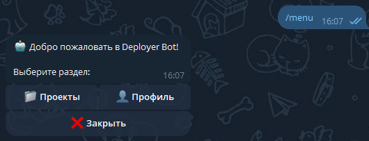
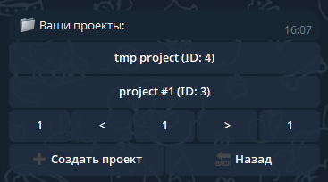
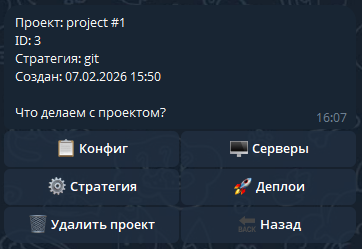
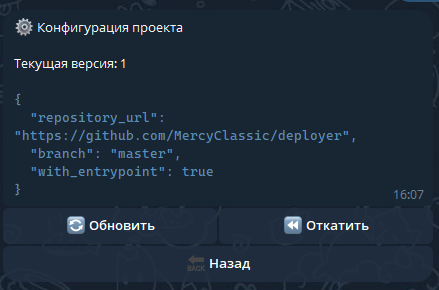
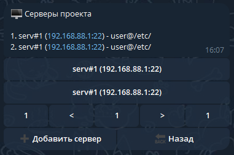
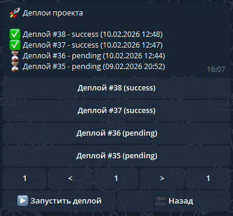
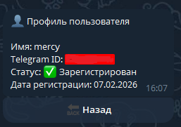

# 🚀 Deployment Automation System via Telegram Bot

## The goal of the project:
- clean architecture
- Domain-Driven Design (DDD)
- interaction with remote servers via SSH
- configuration-driven deployments

---

## ✨ Key Features

- 🤖 **Telegram bot interface** for all user interactions  
- 👥 **Multi-user support** — each user can manage multiple projects  
- 📦 **Multiple deployment strategies**:
  - `shell` — run custom shell commands
  - `git` — clone repository and run entrypoint
  - `docker` — pull image and run container
- 🗂 **Versioned deployment configurations**
- 🔐 **Encrypted secrets storage** (SSH credentials, env vars, registry auth)
- 🖥 **Deploy to multiple servers via SSH**
- 📊 **Deployment status and logs (stdout / stderr)**

---

## 🧱 Architecture Overview

The project follows **Domain-Driven Design (DDD)** principles.

### Aggregates

- **Project** (Aggregate Root)
  - owns servers
  - owns configuration with versions by strategy
  - enforces invariants (one active config, strategy consistency)

- **Deployment** (Aggregate Root)
  - represents a single deployment execution
  - owns deployment logs
  - immutable by design (history)

---

## 🛠 Tech Stack

- **Python 3.13**
- **aiogram 3** + **aiogram_dialog** — Telegram bot framework
- **paramiko** — SSH connections
- **PostgresSQL** — persistent storage
- **SQLAlchemy** — ORM
- **dishka** — ioc container
- **YAML / JSON** — configuration format
- **Type hints** everywhere ✅

---

## 🤖 Telegram Bot Commands

The bot interface (just several examples):

### Main Menu

*Entry point with Projects and Profile options*

### Project Management

*List of all projects with create button*

*Detailed project information with actions*

*Project configuration management*

*Manage project servers - add, remove, view details*

### Deployment Management

*View deployment history, run new deployments, check logs*

### User Profile

*View user profile*

### Navigation
- Use **Projects** button to access project management
- Each project has: Config, Servers, Deployments sections
- Back buttons use smart navigation between states
- All data is validated according to deployment strategy
